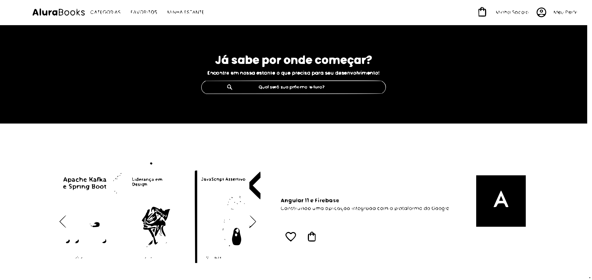

<h1 align="center" style="font-weight: bold;">Alura Books 💻</h1>

    <b>Projeto desenvolvido com a metodologia mobile-first utilizando apenas HTML e CSS</b>

     <a href="https://study-mobile-first.vercel.app/" style="text-decoration: none;">📱 Visite meu projeto </a>

<h2 id="layout">🎨 Layout</h2>

    

<h2 id="technologies">💻 Tecnologias </h2>

- HTML
- CSS
- Swiperjs

<h2 id="started"> 📚 Aprendizado </h2>

- Estudo realizado para aprimorar meu conhecimento em HTML e CSS, enfrentando alguns desafios, como criar um menu hambúrguer sem utilizar JavaScript e também utilizar a biblioteca Swiper.js para desenvolver um carrossel animado.
